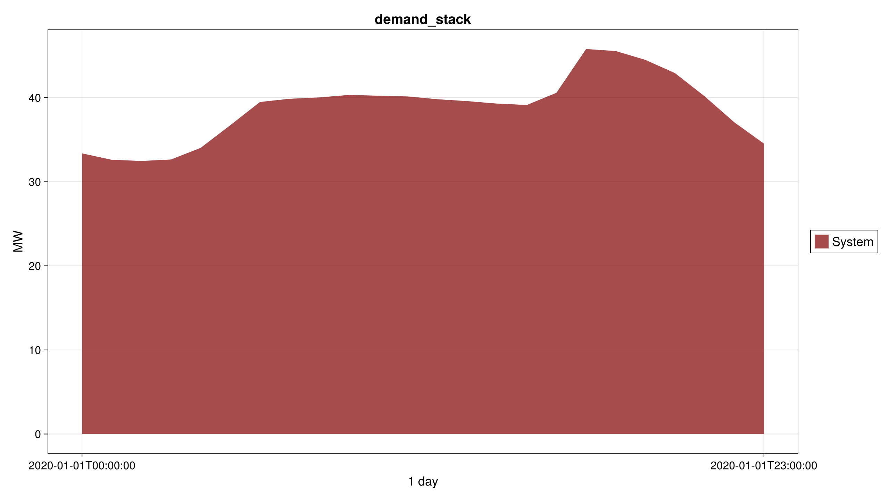
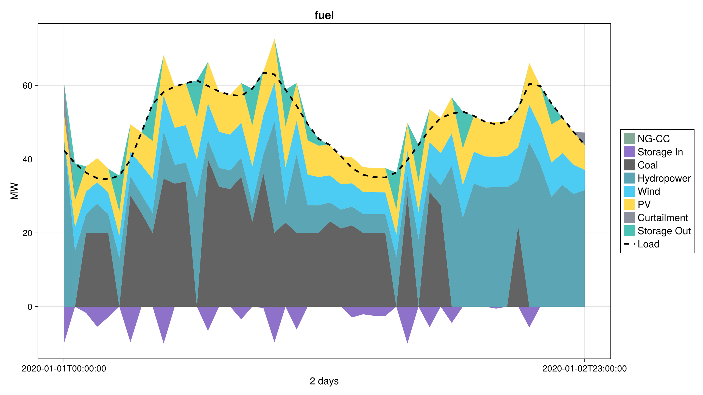
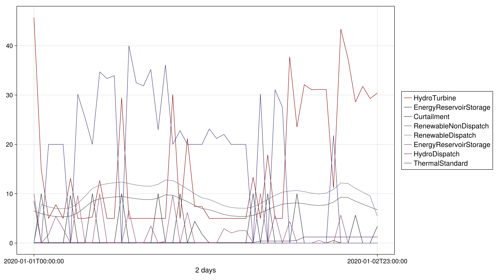
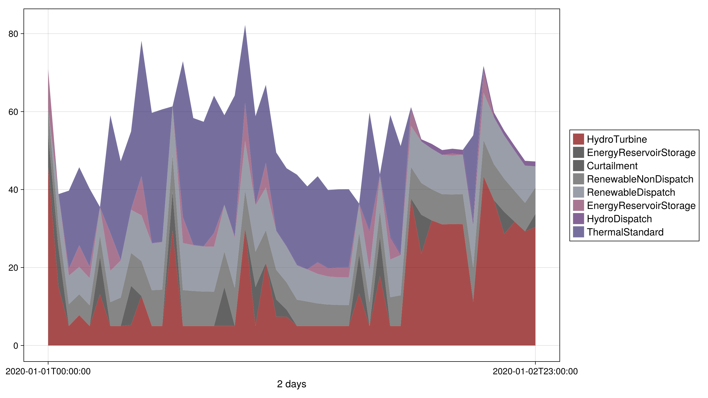
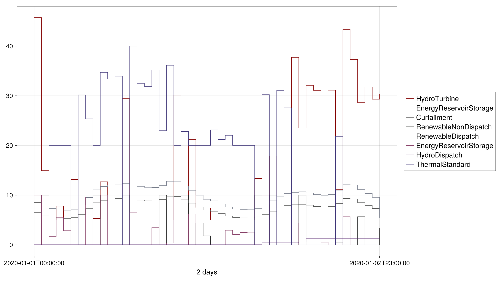
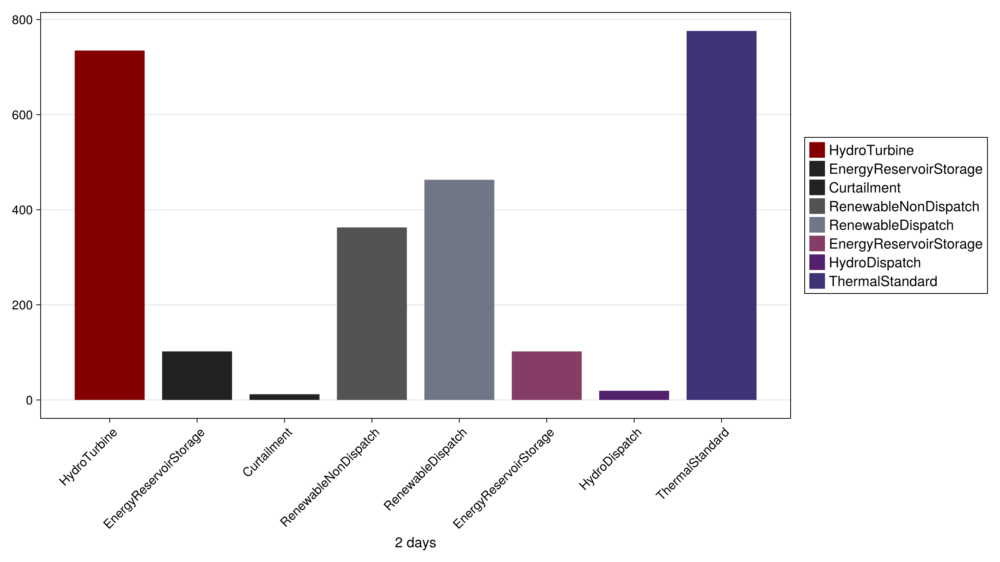
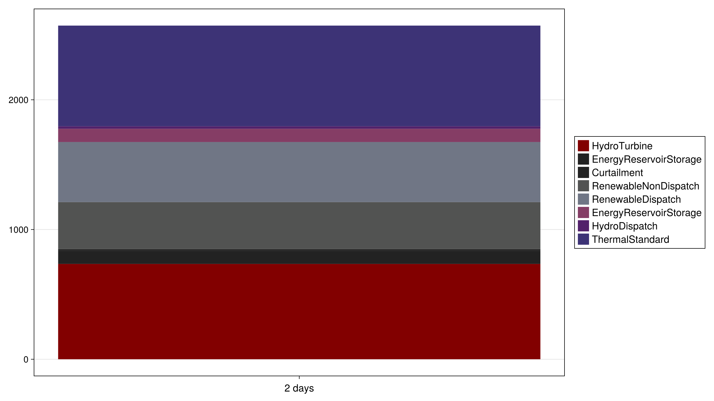
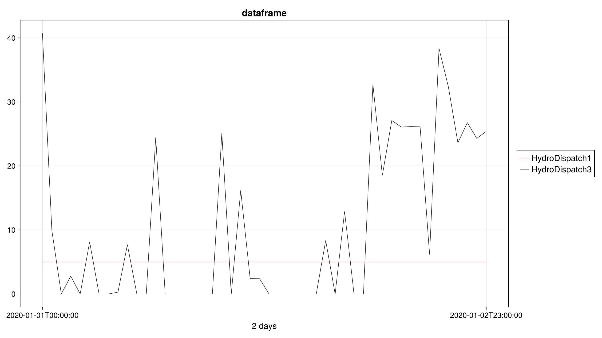

# [Gallery](@id gallery)

```@meta
CurrentModule = PowerGraphics
```

```@raw html
<div class="pg-gallery">
```

```@raw html
<div class="pg-gallery-card">
```

[](@ref plot_demand)

Demand stack
`plot_demand(...; aggregate="System", stack=true)`

```@raw html
</div>
```

```@raw html
<div class="pg-gallery-card">
```

[](@ref plot_fuel)

Fuel
`plot_fuel(res)`

```@raw html
</div>
```

```@raw html
<div class="pg-gallery-card">
```

[](@ref plot_powerdata)

Lines
`plot_powerdata(gen; label_fn=label_component)`

```@raw html
</div>
```

```@raw html
<div class="pg-gallery-card">
```

[](@ref plot_powerdata)

Stack
`plot_powerdata(gen; stack=true, label_fn=label_component)`

```@raw html
</div>
```

```@raw html
<div class="pg-gallery-card">
```

[](@ref plot_powerdata)

Stair
`plot_powerdata(gen; stair=true, label_fn=label_component)`

```@raw html
</div>
```

```@raw html
<div class="pg-gallery-card">
```

[](@ref plot_powerdata)

Bar
`plot_powerdata(gen; bar=true, label_fn=label_component)`

```@raw html
</div>
```

```@raw html
<div class="pg-gallery-card">
```

[](@ref plot_powerdata)

Stacked bar
`plot_powerdata(gen; bar=true, stack=true, label_fn=label_component)`

```@raw html
</div>
```

```@raw html
<div class="pg-gallery-card">
```

[](@ref plot_dataframe)

DataFrame
`plot_dataframe(df, time)`

```@raw html
</div>
```

```@raw html
</div>
```
